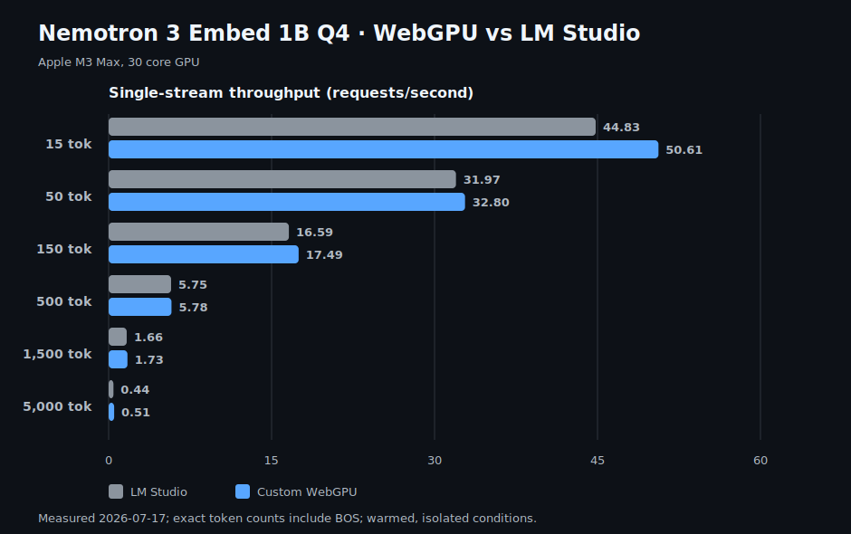
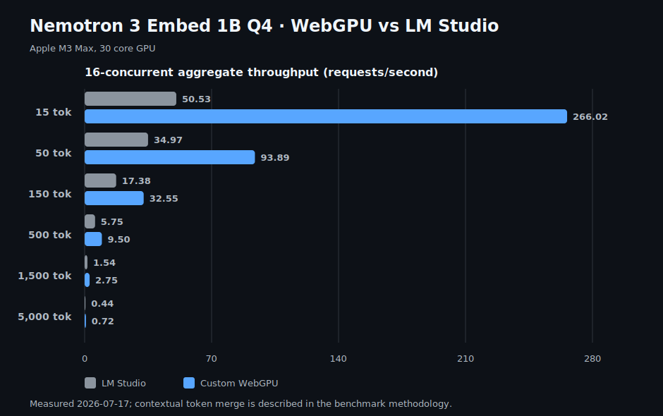

# Nemotron 3 Embed 1B for WebGPU

A browser-native Q4 runtime for NVIDIA Nemotron 3 Embed 1B. It loads one self-contained `.wgpack`, runs custom WGSL kernels, and micro-batches up to 16 simultaneous embedding requests.

## Performance

The charts compare the custom WebGPU runtime with the raw LM Studio endpoint using identical text and exact tokenizer lengths. Model loading is excluded. Each WebGPU row is warmed and measured as an isolated condition; the published LM Studio values are the fastest repeated endpoint result for each row.





| Input | LM Studio single | WebGPU single | LM Studio 16× | WebGPU 16× | LM cosine |
|---:|---:|---:|---:|---:|---:|
| 15 tokens | 44.83 req/s | **69.68 req/s** | 50.53 req/s | **266.02 req/s** | 0.9690 |
| 50 tokens | 31.97 req/s | **48.80 req/s** | 34.97 req/s | **93.89 req/s** | 0.9769 |
| 150 tokens | 16.59 req/s | **24.03 req/s** | 17.38 req/s | **32.55 req/s** | 0.9788 |
| 500 tokens | 5.75 req/s | **8.18 req/s** | 5.75 req/s | **9.50 req/s** | 0.9775 |
| 1,500 tokens | 1.66 req/s | **2.56 req/s** | 1.54 req/s | **2.75 req/s** | 0.9773 |
| 5,000 tokens | 0.44 req/s | **0.76 req/s** | 0.44 req/s | **0.72 req/s** | 0.9773 |

Test hardware: Apple M3 Max, 30 core GPU.

All tokens enter the encoder and the first four layers run at the original sequence length. The runtime then merges adjacent contextual hidden states to 64% of the original length, preserves BOS, and runs the remaining twelve layers on that representation. Merged sequences through 2,048 states use full bidirectional attention; above that, the long-context kernel uniformly samples every third key/value state. These are intentional approximations. Cosine agreement with LM Studio is `0.9330` for a natural 17-token sentence, `0.9285` for varied 96-token prose, and `0.9773` for the deterministic 5,000-token fixture. Native-batch agreement with the single-request WebGPU output is at least `0.999908` across the published matrix.

GPU performance is sensitive to thermals. Run long rows separately and allow the GPU to cool before collecting another row. The complete measurements and methodology are in [`docs/benchmarks/2026-07-17-webgpu-vs-lm-studio-m3-max.json`](docs/benchmarks/2026-07-17-webgpu-vs-lm-studio-m3-max.json).

## Required model

Normal use requires only this release asset:

| Artifact | Contents | Size | SHA-256 |
|---|---|---:|---|
| [`nemotron-3-embed-1b-q4-webgpu.wgpack`](https://github.com/shihanqu/nemotron-3-embed-webgpu/releases/download/wgpack-v1/nemotron-3-embed-1b-q4-webgpu.wgpack) | Complete model weights, metadata, tokenizer-independent tensor data, and 64 GPU-tiled projection matrices | 730.3 MiB | [`0f7c30…3bec`](docs/wgpack-v1.sha256) |

The app uses that GitHub Release asset by default. It does not download or parse a GGUF at runtime. The tokenizer is loaded from [`nvidia/Nemotron-3-Embed-1B-BF16`](https://huggingface.co/nvidia/Nemotron-3-Embed-1B-BF16).

The pack was built from [`zenmagnets/Nemotron-3-Embed-1B-Q4_K_M-GGUF`](https://huggingface.co/zenmagnets/Nemotron-3-Embed-1B-Q4_K_M-GGUF), file `nemotron-3-embed-1b-q4_k_m.gguf`, SHA-256 `9a74166f51dbc280073748fa199bea49283bd21f7f9280f2dec2b4d975ddfd1d`.

## Quick start

Requirements: Node.js 24, npm, and a Chromium-based browser with WebGPU enabled.

```sh
git clone https://github.com/shihanqu/nemotron-3-embed-webgpu.git
cd nemotron-3-embed-webgpu
npm ci
npm run dev
```

Open `http://127.0.0.1:5173/` and click **Load model & benchmark kernel**. The development server proxies the pinned GitHub Release asset through the local origin.

To use a local pack instead, place it under `models/` and override the URL:

```sh
VITE_PREPACKED_MODEL_URL=/models/nemotron-3-embed-1b-q4-webgpu.wgpack npm run dev
```

## Expected system requirements

These are practical estimates, not hard compatibility guarantees.

| Resource | Minimum | Recommended for long 16-request runs |
|---|---|---|
| Browser | Current Chromium browser with WebGPU, `shader-f16`, and subgroups | Current stable Chrome or Edge |
| GPU | Apple Silicon or a modern NVIDIA/AMD GPU with at least 4 GB available GPU/shared memory | 12 GB or more available GPU/shared memory |
| System memory | 16 GB | 32 GB or more |
| Storage | 1.5 GB free for the pack, browser cache, and build output | 2 GB free |
| WebGPU storage binding | 128 MiB | 512 MiB |

The scheduler automatically reduces native batch size when an adapter exposes a smaller storage-buffer binding limit. That preserves correctness but can reduce concurrent throughput.

## What was optimized

The offline converter and runtime are specialized for Nemotron’s 16-layer, 2,048-hidden-size Mistral3 encoder:

- Q, K, and V are fused into one projection per layer; FFN gate and up projections are fused as well.
- Q4_K and Q6_K projection tensors are requantized offline to Q4_0 and rearranged into aligned 32-row GPU tiles.
- A subgroup matmul kernel broadcasts activations across 32 rows so each quantized weight block serves many requests or tokens.
- A 16-row subgroup path reduces wasted work for short, high-output projection matrices.
- Separate 16-row and 64-row bidirectional FlashAttention-style kernels cover short and long sequence regimes.
- QK dot products and value accumulation use FP16 while online softmax maxima and denominators stay FP32.
- RoPE uses a portable two-dimensional dispatch, avoiding WebGPU’s 65,535-workgroup limit on long native batches.
- After four full-context encoder layers, a GPU token-merge kernel bins adjacent contextual states to 64% of the original sequence length while preserving BOS; all sixteen layers still run.
- Residual addition plus RMSNorm, SwiGLU, mean pooling, L2 normalization, and storage-aware concurrent scheduling have dedicated kernels.

The resulting `.wgpack` is self-contained and 765,745,152 bytes (730.3 MiB), about 2.2% larger than the 714.6 MiB source GGUF. Startup requires no matrix concatenation, requantization, or tensor repacking in the browser.

## Reproduce the comparison

Start LM Studio’s local server with `text-embedding-nemotron-3-embed-1b` loaded at `http://127.0.0.1:1234`, then start this app.

Run a WebGPU row in the browser:

```text
http://127.0.0.1:5173/?matrix=1&tokens=500
```

Run the matching LM Studio conditions:

```sh
npm run bench:baseline -- \
  --model=text-embedding-nemotron-3-embed-1b \
  --tokens=500 --concurrency=1,16 --duration-ms=10000 --warmup=5
```

Supported exact lengths are `15`, `50`, `150`, `500`, `1500`, and `5000`. The deterministic fixtures live in [`scripts/workloads.ts`](scripts/workloads.ts). Run each long-context condition separately; do not compare a cooled endpoint with a thermally throttled WebGPU row.

Regenerate both README charts from the checked-in benchmark JSON:

```sh
npm run bench:chart
```

## Build the pack

Only pack authors need the source GGUF:

```sh
npm ci
npm run model:prepack -- \
  models/nemotron-3-embed-1b-q4_k_m.gguf \
  models/nemotron-3-embed-1b-q4-webgpu.wgpack
```

The format starts with the `WGPACK02` magic value, followed by a JSON tensor index and 256-byte-aligned payloads. The header records the exact source GGUF SHA-256. See [`src/prepacked/format.ts`](src/prepacked/format.ts) and [`scripts/prepack-model.ts`](scripts/prepack-model.ts) for the authoritative layout.

## Portability

The `.wgpack` contains no machine ISA, and the kernels are standard WGSL. The design is GPU-architecture agnostic and should work on NVIDIA and AMD hardware when the browser exposes the required WebGPU features. Performance is not architecture-independent: subgroup behavior, memory limits, drivers, and browser implementations differ. This release has been validated only on Apple M3 Max, 30 core GPU.

## Development

```sh
npm run check
```

Key files:

- [`scripts/prepack-model.ts`](scripts/prepack-model.ts) — deterministic GGUF-to-`.wgpack` conversion.
- [`src/webgpu/quant-matmul.ts`](src/webgpu/quant-matmul.ts) — Q4 latency, batch, and subgroup matmul kernels.
- [`src/webgpu/ops.ts`](src/webgpu/ops.ts) — RoPE, attention, normalization, SwiGLU, and pooling kernels.
- [`src/webgpu/model.ts`](src/webgpu/model.ts) — tensor uploads and reusable execution plans.
- [`src/webgpu/embedding-engine.ts`](src/webgpu/embedding-engine.ts) — storage-aware concurrent micro-batching.

## License

Runtime source code is [MIT licensed](LICENSE). Model materials retain the upstream [OpenMDW 1.1 license](MODEL_LICENSE) and notices in [MODEL_NOTICE.md](MODEL_NOTICE.md) and [THIRD_PARTY_NOTICES.md](THIRD_PARTY_NOTICES.md).
